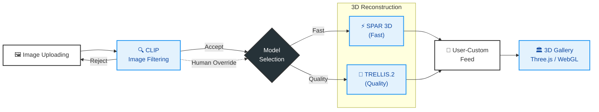
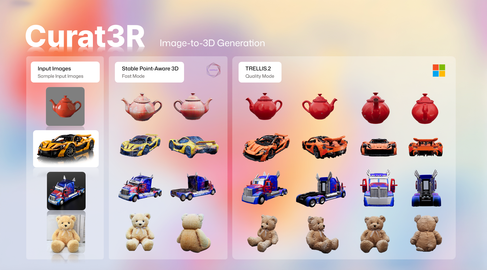
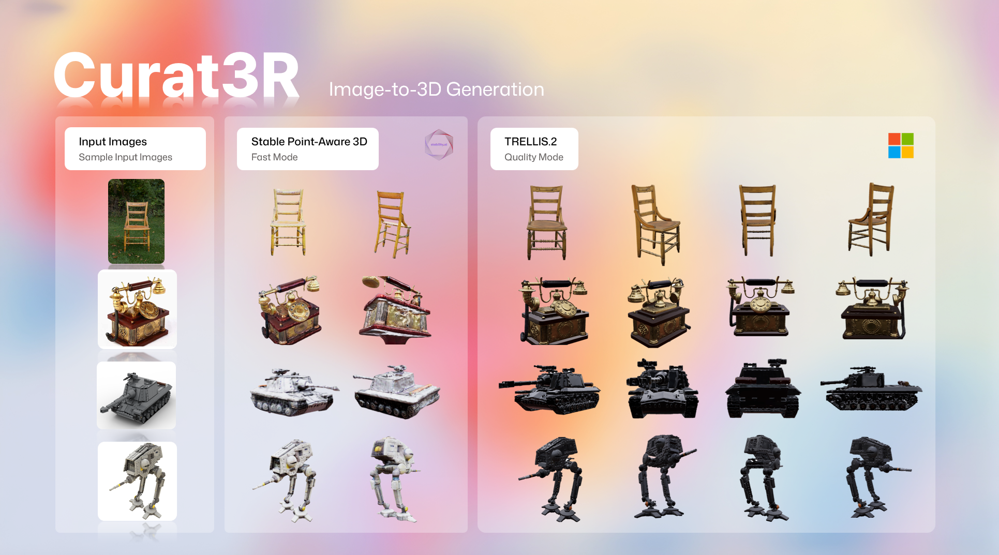
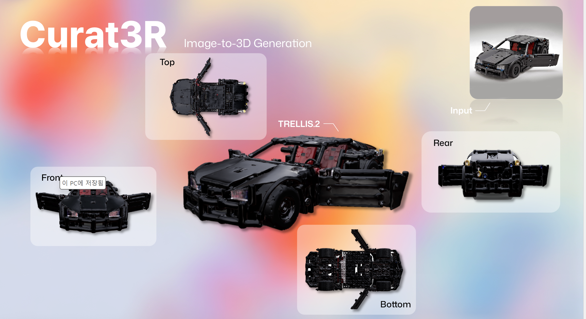

# Curat3R: 나만의 3D 박물관 만들기 (Make Your Own 3D Museum)
> 


> **단 한 장의 사진으로 소중한 물건을 3D 디지털 아티팩트로 복원하여 영구 소장하는 웹 서비스**

*ToBig's 21th Conference Computer Vision Project*

## 📖 프로젝트 소개

**Curat3R**는 사용자가 소장하고 싶은 물건(장난감, 기념품 등)의 사진을 한 장만 업로드하면, AI를 통해 즉시 3D 모델로 변환해주는 서비스입니다. 생성된 3D 모델은 웹 뷰어를 통해 360도로 감상할 수 있으며, '나만의 박물관'에 저장하고 배치할 수 있습니다.

### 👥 프로젝트 멤버

| 이름 | 소속 |
|---|---|
| **김민정** ([@Andante-Kim](https://github.com/Andante-Kim)) | ToBig's 23rd |
| **김상우** ([@Underove](https://github.com/Underove)) | ToBig's 23rd |
| **윤정우** ([@airacle100](https://github.com/airacle100)) | ToBig's 24th |
| **임규원** ([@gwlim3012](https://github.com/gwlim3012)) | ToBig's 23rd |
| **정서영** ([@jnalgae](https://github.com/jnalgae)) | ToBig's 23rd |

---

## ✨ 핵심 기능 (Key Features)

### 1. 지능형 이미지 필터링 (CLIP-based Filtering)
- 사용자가 업로드한 이미지가 3D 복원에 적합한지 판단합니다.
- **CLIP (ViT-B/32)** 모델을 사용하여 객체의 명확성, 배경 복잡도 등을 분석하여 `Accept` 또는 `Reject` 판정을 내립니다.

### 2. 듀얼 모드 3D 복원 (Dual Mode Reconstruction)
사용자의 목적에 따라 두 가지 최적화된 복원 모드를 제공합니다.

| 모드 | 모델 (Model) | 특징 | 소요 시간 |
|---|---|---|---|
| **⚡ 빠른 생성 (Fast)** | **SPAR3D** | **자동 배경 제거(Remover)** 포함, 빠른 속도, 일반적인 형상 복원 | **약 30초 ~ 1분** |
| **💎 고품질 생성 (Quality)** | **Trellis.2** | 정교한 지오메트리 및 텍스처, 고해상도 메쉬 생성 | **약 5분 ~ 10분** |

> **💡 참고:** CLIP 필터가 이미지를 거부(Reject)하더라도, 사용자가 재구성을 원하는 경우 **'Human Override'** 기능을 통해 강제 생성을 요청할 수 있습니다.

### 3. 인터랙티브 웹 UI
- **Next.js** 기반의 직관적인 사용자 인터페이스
- 실시간 진행 상태 모니터링 (Polling)
- WebGL 기반 3D 뷰어 (React Three Fiber) 및 썸네일 생성

---

## 🏗️ 시스템 아키텍처 (System Architecture)


---

## 🛠 기술 스택 (Tech Stack)

| 분류 | 기술 |
|---|---|
| **Frontend** | Next.js, React, Tailwind CSS, Three.js (React Three Fiber) |
| **Backend** | Python, Flask |
| **AI / ML** | PyTorch, CLIP, **SPAR3D**, **Trellis.2** |
| **Infrastructure** | Linux (Ubuntu), NVIDIA GPU (CUDA) |

---

## 📁 디렉토리 구조 (Directory Structure)

```bash
Curat3R/
├─ pipeline/                 # Python Flask 백엔드 및 AI 파이프라인
│  ├─ pipeline_server.py     # 메인 서버 (CLIP + SPAR3D/Trellis 실행 관리)
│  ├─ clip_filter.py         # CLIP 필터링 모듈
│  ├─ run_spar3d.py          # SPAR3D 실행 스크립트 (배경 제거 포함)
│  ├─ run_trellis.py         # Trellis 실행 래퍼(Wrapper) 스크립트
│  ├─ requirements.txt       # 의존성 목록
│  ├─ models/                # 모델 가중치 (Git LFS)
│  └─ start_server.sh        # 서버 실행 스크립트
│
├─ src/                      # Next.js 프론트엔드
│  ├─ app/                   # 페이지 라우팅
│  ├─ components/            # UI 컴포넌트
│  └─ services/              # API 통신 로직
│
└─ README.md                 # 프로젝트 문서
```
---

## ⚙️ 시작 가이드 (Getting Started)

> **⚠️ 시스템 요구사항**
> 
> 본 프로젝트는 **NVIDIA RTX 5090 (24GB+ VRAM)** 및 **Linux (Ubuntu/WSL2)** 환경에서 테스트되었습니다. 윈도우 네이티브 환경에서는 경로 설정에 주의가 필요합니다.

### 1. 외부 리소스 및 모델 설정 (Prerequisites)

이 프로젝트는 **SPAR3D**와 **Trellis.2**를 구동하기 위해 각각의 리포지토리와 가상환경이 필요합니다.

1.  **SPAR3D (Fast Mode)**
    * Stable-Point-Aware-3D 공식 리포지토리를 클론합니다.
    * `model.safetensors`와 `config.yaml`을 다운로드하여 준비합니다.
2.  **Trellis.2 (Quality Mode)**
    * TRELLIS.2 공식 리포지토리를 클론합니다.
    * Trellis.2는 별도의 Conda 환경(예: `trellis311`) 구성을 권장하며, 해당 환경의 Python 실행 경로를 `pipeline_server.py`에 등록해야 합니다.

### 2. 경로 변수 수정 (Configuration)

`pipeline/pipeline_server.py` 파일을 열어, 위에서 설치한 모델들의 경로를 로컬 환경에 맞게 수정해야 합니다.

```python
# [pipeline_server.py 내부 설정 예시]

# 1. SPAR3D 설정 (Conda 환경 및 리포지토리 경로)
SF3D_ENV = "/home/user/miniconda3/envs/spar3d/bin/python" 
SPAR3D_ROOT = "/home/user/projects/stable-point-aware-3d"

# 2. Trellis.2 설정 (Conda 환경 및 리포지토리 경로)
TRELLIS_ENV = "/home/user/miniconda3/envs/trellis311/bin/python"
TRELLIS_ROOT = "/home/user/projects/TRELLIS.2"
```
---

### 3. 서버 실행 (Run)

**Frontend (Next.js)**
```bash
cd src
npm install
npm run dev
# 브라우저 접속: http://localhost:3000
```

**Pipeline Server (Flask)**
```bash
cd pipeline

# 가상환경 활성화 (메인 서버용)
python -m venv .venv
source .venv/bin/activate
pip install -r requirements.txt

# 서버 실행
python pipeline_server.py
```

### 환경 변수 (Environment Variables)
Hugging Face의 비공개 모델(Gated Model)에 접근해야 할 경우, 아래 환경 변수를 설정하세요.
```bash
export HF_TOKEN="your_huggingface_token"
```

---

## 📡 API 명세 (API Endpoints)

| Method | Endpoint | 설명 | 파라미터 |
|---|---|---|---|
| **POST** | `/api/pipeline/filter` | 이미지 적합성 판별 (CLIP) | `form-data`: image |
| **POST** | `/api/pipeline/reconstruct/<task_id>` | 3D 생성 요청 (Fast/Quality) | JSON: `{ "model": "fast" \| "quality" }` |

---

## 🧩 모델 크레딧 (Credits)

이 프로젝트는 다음의 오픈소스 모델들을 활용하여 개발되었습니다.

1.  **SPAR3D (Stable Point-Aware 3D)** by Stability AI
    - Fast Mode의 핵심 모델로, 단일 이미지에서 Point Cloud 기반으로 Mesh를 생성합니다.
2.  **Trellis.2** by Microsoft Research
    - Quality Mode의 핵심 모델로, 고품질의 3D Geometry와 Texture를 생성합니다.
3.  **CLIP** by OpenAI
    - 이미지의 의미론적 분석 및 필터링에 사용됩니다.

---

## 🖼️ 데모 (Demo)

### CLIP 필터링 (Image Filtering)


### 3D 생성 결과





### 웹 인터페이스 (Web Interface)


---

## 데모 영상 (Demo Video)
<a href="https://youtu.be/ptxr5rqzewE">
  
</a>

---
